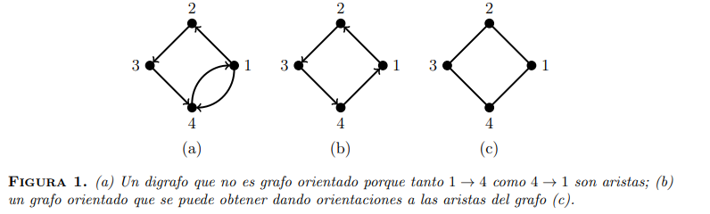
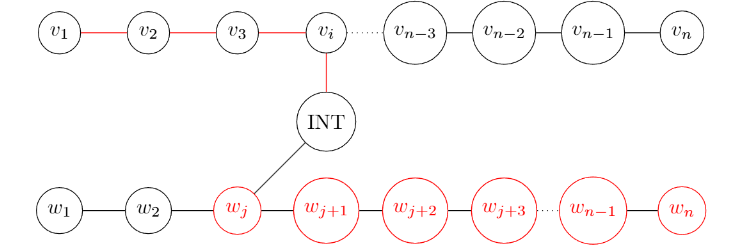

# Demostración de propiedades simples sobre grafos

## 1) Equilibrio Digrafo
⋆Demostrar, usando inducción en la cantidad de aristas, que todo digrafo D satisface 

$$\sum_{v ∈ V(D)} d_{in}(v) = \sum_{v ∈ V(D)} d_{out}(v) = |E(D)|$$

>- **Caso base:** Tomo $m = |E(D)| = 0$ y por lo tanto tenemos a todos los vertices desconectados, de forma que
>
  >$$ \sum_{v ∈ V(D)} d_{in}(v) = 0 = \sum_{v ∈ V(D)} d_{out}(v) $$
>
> - **Paso Inductivo:**
>   - **HI**: $|E(D)| ≤ m - 1$ vale $$\sum_{v ∈ V(D)} d_{in}(v) = \sum_{v ∈ V(D)} d_{out}(v) = |E(D)|$$
>   - Qvq vale para $|E(D)| = m$
>   - Sea $(i → j) ∈ E(D)$, y llamemos $D' = (V(D), E(D) ∖ \{(i → j)\})$. De esta forma
  $|E(D)| = |E(D') \oplus (i → j)| = |E(D')| + |\{(i → j)\}| = |E(D')|+1 = m-1 + 1 = m$
>
> $$\begin{align*}
      \Longrightarrow \sum_{v ∈ V(D)} d_{in}(v) & =
          \sum_{v ∈ V(D) ∖ \{(i→j)\}} d_{in}(v) + d_{in}^D(j)\\
      & = \sum_{v ∈ V(D) ∖ \{(i→j)\}} d_{in}(v)  + d_{in}^{D'}(j) + 1 \\
      & =  \sum_{v ∈ V(D')} d_{in}(v) + 1 = |E(D')| + 1 = |E(D)|
\end{align*}$$
>
>$$\begin{align*}
      \Longrightarrow \sum_{v ∈ V(D)} d_{out}(v) & =
          \sum_{v ∈ V(D) ∖ \{(i→j)\}} d_{out}(v) + d_{out}^D(i)\\
      & = \sum_{v ∈ V(D) ∖ \{(i→j)\}} d_{out}(v)  + d_{out}^{D'}(i) + 1 \\
      & =  \sum_{v ∈ V(D')} d_{out}(v) + 1 = m-1 + 1 = m
\end{align*}$$
>
> - $\Longrightarrow \sum_{v ∈ V(D)} d_{in}(v) = \sum_{v ∈ V(D)} d_{out}(v) = m_{ \ \ \blacksquare}$

## 2) Doble grado
⋆Demostrar, usando la técnica de reducción al absurdo, que todo grafo no trivial tiene al menos dos vértices del mismo grado. **Ayuda:** prestar atención a la secuencia ordenada de los grados de los vértices.
>
> **D/** Sea $G = (V, E)$ un grafo no trivial $(|V| = n > 1)$. Supongamos que no tiene 2 vértices del mismo grado ⟹ todos los vértices tienen distinto grado:
>$$d(u) \neq d(v) \;\; ∀ u \neq v \in V$$
>Por lo tanto, sin pérdida de generalidad, podemos ordenar a los vértices por su grado: $V = \{v_1, ..., v_n\}$ donde pasan una de las siguientes situaciones_
>- $1 ≤ d(v_i) < d(v_j) ≤ n - 1 \;\; ∀ \; 1 ≤ i < j ≤ n$
>- $0 ≤ d(v_i) < d(v_j) ≤ n - 2 \;\; ∀ \; 1 ≤ i < j ≤ n$
>
>Por lo tanto tenemos que repartir $n-1$ grados distintos para n vértices. ABS! $\ \blacksquare$

## 3) Unicidad Digrafo
⋆Un grafo orientado (Ver Figura 1) es un digrafo D tal que al menos uno de  v → w y w → v no esuna arista de D, para todo v, w ∈ V (D). En otras palabras, un grafo orientado se obtiene a partir de un grafo no orientado dando una dirección a cada arista. Demostrar en forma constructiva que para cada n existe un único grafo orientado cuyos vértices tienen todos grados de salida distintos. 
**Ayuda:** aprovechar el ejercicio anterior y observar que el absurdo no se produce para un único grafo orientado.

## 4) Arte Conexo
Un vértice v de un grafo G es un punto de articulación si G − v tiene más componentes conexas que G. Por otro lado, un grafo es biconexo si es conexo y no tiene puntos de articulación.

  a) ⋆Demostrar, usando inducción en la cantidad de vértices, que todo grafo de n vértices que tiene más de (n − 1)(n − 2)/2 aristas es conexo. Opcionalmente, puede demostrar la misma propiedad usando otras técnicas de demostración.

  > - **Caso base (n = 2):** si tiene más de $(2 - 1)(2 - 1)/2 = 0$ aristas ⟹ $m = 1$. Por lo tanto tenemos el grafo $ \ \bullet$-----$\bullet \ $ que es conexo.
  > - **Paso Inductivo:** $P(n_0) ⟹ P(n_0 + 1)$ con la siguiente **HI**:
  >
  >   $P(n) ≡ \text{si un grafo de n vértices tiene más de } (n - 1)(n - 2)/2 \text{aristas} ⟹ \text{es conexo}$
  >
  >    Supongamos que tenemos un grafo $G$ con $|V(G)| = n = n_0 + 1$ vértices. Qvq si $|E(G)| > (n-1)(n-2)/2 = n_0(n_0-1)/2$ ⟹ es $G$ conexo.
  >   - **Obs:** no puede haber ningun vértice en $G$ de grado $0$.
  >     Supongamos que si, i.e., $∃ \ \ v ∈ V(G) \ / \ d(v) = 0$.
  >
  >     Considero el grafo $G' = G - v$, qué tendrá $|V'| = |V(G')| = n - 1 = n_0$ nodos pero la misma cantidad de aristas $|E'| = |E(G')| = |E(G)|$. Dado que que tiene $n_0$ vértices, $G'$ podrá tener como máximo
  >     $$ |E'| ≤ \binom{|V'|}{2} = \frac{n_0(n_0-1)}{2}$$
  >     aristas. Pero dijimos que $G' = G - v$ tiene la misma cantidad de aristas que G, que a su vez tiene más de $n_0(n_0-1)/2$ aristas. Es decir $$|E'| > n_0(n_0-1)/2$$ ABS! ⟹ $d(v) > 0 \ \ ∀ \ v ∈ V$.
  >
  >   - Si hay algún nodo $v$ de grado 1, el grafo $G' = G - v$ tiene $n_0$ nodos y $$|E'| > \frac{n_0(n_0 - 1)}{2} - 1 > \frac{(n_0-1)(n_0 - 2)}{2}$$ aristas pues $$\frac{n_0(n_0 - 1)}{2} - 1 > \frac{(n_0-1)(n_0 - 2)}{2} ⟺$$ $$-n_0 - 2 > -3n_0 + 2 ⟺ 2n_0 > 4 ⟺ n_0 > 2 \; ✅$$
  > Luego, por HI, G' es conexo. Y como G - v es un subgrafo conexo de G, dado que d(v) > 0 ⟹ G debe ser conexo también. Entonces vale $P(n_0+1)$
  >   - ¿Hasta qué grado vale?
  >
  >     Sea $a$ el mayor grado del vértice v que saco (d(v) ≤ a) y $G' = G - v \ / \ |V'| = n_0$ y $|E'| > n_0(n_0-1) - a$. Quiero ver que
  >     $$\frac{n_0(n_0-1)}{2} - a > \frac{(n_0-1)(n_0-2)}{2} ⟺$$
  >     $$ -n_0 - 2a > -3n_0 + 2 ⟺ a < n_0 - 1$$
  >     Luego podemos sacar nodos de hasta grado $n_0 - 2$.
  >
  >   Si G tenía un nodo de grado $n_0 - 1$ ya sabemos que era conexo. Por lo tanto podemos sacar nodos de cualquier grado y $G' = G - v$ va a ser conexo y como G' es un subgrafo de G y el vértice de G que sacamos tiene grado mayor a 0, G también es conexo. Entonces vale $P(n_0+1)$.
  
  b) Demostrar por medio de una reducción al absurdo que todo grafo de n vértices que tenga al menos 2 + (n − 1)(n − 2)/2 aristas es biconexo.

  > Sea $G \; / \; |V(G)| = n$.
  > - Como $|E| \ge 2 + \frac{(n-1)(n-2)}{2} > \frac{(n-1)(n-2)}{2} \underset{a)}{⟹}$ G es conexo.
  > - Falta ver que no tiene puntos de articulación:
  >  
  >   Supongamos que si tiene ⟹ $∃ v ∈ V \; / \; G - v$ no es conexo. 
  >   $$ \underset{a)}{⟹} |E(G-v)| ≤ \frac{(n-2)(n-3)}{2}$$
  >   A su vez $|E(G-v)| = |E(G)| - d(v) ≥ 2 + \frac{(n-1)(n-2)}{2} - d(v)$
  >   Por lo tanto
  >   $$ 2 + \frac{(n-1)(n-2)}{2} - d(v) ≤ \frac{(n-2)(n-3)}{2} $$
  >   $$ 4 + n^2 - 3n + 2 - 2d(v) ≤ n^2 - 5n + 6 $$
  >   $$2n ≤ 2d(v)$$
  >   $$n ≤ d(v) ❌$$
  >   ABSURDO! ⟹ $G$ no tiene puntos de articulación. $ \ \blacksquare$

## 5) Ciclo Compartido
⋆Sean $P$ y $Q$ dos caminos distintos de un grafo $G$ que unen un vértice $v$ con otro $w$. Demostrar en forma directa que $G tiene un ciclo cuyas aristas pertenecen a $P$ o $Q$. **Ayuda:** denotar $P = v_0, . . . , v_p$ y $Q = w_0, . . . , w_q$ con $v_0 = w_0 = v$ y $v_p = w_q = w$. Definir explícitamente cuáles son los subcaminos de $P$ y $Q$ cuya unión forman un ciclo.

> Que $P$ y $Q$ sean caminos de $v$ a $w$ nos dice que a $P$ y $Q$ los podemos escribir como:
> - $P = p_1, . . . , p_k$
> - $Q = q_1, . . . , q_r$
>
> Donde $p_1, . . . , p_k, q_1, . . . , q_r$ son nodos de $G$. Además $p_1 = v = q_1, p_k = v = q_r$ y vale que entre todo nodo y el siguiente hay una arista:
> - $(p_i, p_i+1) ∈ E$ para todo $1 ≤ i < k$
> - $(q_j, q_j+1) ∈ E$ para todo $1 ≤ j < r$
>
> Como son distintos pero los dos arrancan en el mismo lugar, en algún momento se tienen que separar. Asumamos que se separan por primera vez en el i-ésimo vértice (hablamos del primero porque podría ocurrir que se junten y se separen varias veces). Es decir: $∀ \ l ∈ \mathbb{N}$ en el rango $1 ≤ l < i$ ocurre que $p_l = q_l$, pero $p_i \neq q_i$.
>
> Eventualmente P y Q se tienen que volver a juntar dado que ambos terminan en w. Asumamos que se juntan por primera vez en $p_{j_p}$ y $q_{j_q}$ luego de separarse en $p_i$. Es decir:
> - $∃ \ i ∈ \mathbb{N}$ tal que $1 < i < k$, $ \ i < r$ y $∀l ∈ \mathbb{N}$ en el rango $1 ≤ l < i$ ocurre que $p_l \neq q_l$, pero $p_{l_p} = q_{l_p}$
>
> ¡Ahora ya podemos construir nuestro ciclo!  $$p_{i−1}, p_i, p_{i+1}, . . . , p_{j_{p−1}}, p_{j_p} = q_{j_q}, q_{j_{q−1}}, . . . q_{i+1}, q_i, q_{i−1} = p_{i−1}$$
> Nos faltaría ver que tiene al menos 3 nodos. ¿Por qué hace falta? Notar que $i ≤ j_p$ y $i ≤ j_q$. Si $i = j_p$ y $i = j_q$ no nos queda un ciclo!
>
> 
>
>  Sin embargo, eso no puede pasar porque implicaría que $p_i = p_{j_p} = q_{j_q} = q_i$, es decir $p_i = q_i$ que es un absurdo (tomamos i tal que $p_i \neq q_i$)
>
> Luego, podemos dividir en los casos cuando $i = j_q$ (izquierda), $i = j_p$ (derecha) o que no sea igual a ninguno.

## 6) Modelado Básico
Probar que en todo grupo de dos o más personas hay por lo menos dos de ellas que tienen la misma cantidad de amigos en el grupo.

> El enunciado habla de una red social, la cual la podemos modelar como un grafo donde los nodos representan a las personas. Va a haber una arista entre dos nodos si las dos personas que representan son amigos.
>
>Para todo grafo (**grupo de personas**) de dos o más nodos (**personas**) hay por lo menos dos nodos con la misma cantidad de aristas (**amigos**), es decir que tienen el mismo grado. Formalmente:
> $$∀ G, |V| = n ≥ 2, \ ∃ \ v_1, v_2 \ \ \text{tales que} \ \ v_1 \neq v_2 ∧ d(v_1) = d(v_2)$$
> Para todo grafo vale que $0 ≤ d(v) ≤ n−1$. Pero, ¿es posible que exista simultáneamente un nodo que esté conectado a todos los demás y un nodo que no esté conectado a nadie? Esto no tendría sentido porque si hay un nodo conectado a todos este necesariamente tendría que también estar conectado al que no está conectado a nadie, pero eso no puede ser.
> - $0 ≤ d(v) ≤ n − 2$ (puede haber alguien sin amigos)
> - $1 ≤ d(v) ≤ n − 1$ (puede haber un amigo de todos)
>
> Por lo tanto, ¿cuántos valores puede realmente tomar d(v)? A lo sumo n − 1. 
>
> Por lo que argumentamos antes sabemos que hay a lo sumo n − 1 grados distintos en nuestro grafo. ¡Pero nuestro grafo tiene exactamente n nodos! $ \ \therefore \ $ hay al menos dos nodos que comparten grado. Así que demostramos lo que queríamos. $ \ \blacksquare$

## 7) Intersección Máxima
⋆ Sea G un grafo conexo. Demostrar por el contrarrecíproco que todo par de caminos simples de longitud máxima de G tienen un vértice en común. **Ayuda:** suponer que hay dos caminos disjuntos en vértices de igual longitud y definir explícitamente un camino que sea más largo que ellos.

> Sea $G = (V, E)$ un grafo conexo. Sup. 2 caminos $P = v_1, ..., v_l$ y Q = $w_1, . . . , w_l$ de la misma longitud $l = \underset{C}{max} \ L(C)$ / todos los vértices distintos son entre si.
>
> $G$ es conexo $⟹$ existe un camino entre todos los vértices.
>
> Sea $I$ con $|I| > 0$ el camino mínimo intermedio entre $P$ y $Q$.
>
> 
>
> Sea $P'$ la parte más grande de P respecto de $v_i$, es decir
> $$ 
  P' = \begin{cases}
    v_1, ... v_i & 
      \text{si} \; i ≥ l/2 \\
    v_i, ... , v_l & 
      \text{si} \; i < l/2
  \end{cases}
> $$
> y Q' la parte más grande de Q respecto $w_j$.
> $$ 
  Q' = \begin{cases}
    w_1, ... w_j & 
      \text{sj} \; j ≥ l/2 \\
    w_j, ... , w_l & 
      \text{si} \; j < l/2
  \end{cases}
> $$
> Armamos ahora el camino $C = P' + I + Q'$, que cumple
> $$ C = |P'| + |I| + |Q'| ≥ \frac{l}{2} + |I| + \frac{l}{2} = l + |I| > l$$
> Observemos que contruimos un camino más largo que P y Q, pero P y Q eran máximos. ¡ABSURDO! La contradicción provino de suponer que no había vértices comunes entre P y Q. Asi que vale lo que queríamos probar.

## 8) UniónVsJunta
La unión disjunta $G ∪ H$ de dos grafos $G$ y $H$ con $V(G) ∩ V(H) = ∅$ es el grafo con $V(G ∪ H) = V(G) ∪ V(H)$ y $E(G ∪ H) = E(G) ∪ E(H)$. Es decir, $G ∪ H$ se obtiene de dos grafos disjuntos uniendo $G$ con $H$ sin agregar aristas. Por otra parte, la junta $G + H$ de G y $H$ es el grafo que se obtiene de $G ∪ H$ agregando todas las aristas $vw$ posibles entre un vértice $v ∈ V$ y otro vértice $w ∈ V(H)$. Decimos que $G$ es un grafo unión (resp. junta) si existen $G_1$ y $G_2$ con $V(G_1) ∩ V(G_2) = ∅$ tales que $G = G_1 ∪ G_2$ (resp. $G = G_1 + G_2$).

a) Demostrar en forma directa que G es un grafo unión si y sólo si G es disconexo.

> - ⟹) G es un grafo unión ⟹ $ ∃ \ G_1$ y $G_2$ tal que $V(G_1) \cap V(G_2) = ∅$  y $G = G_1 \cup G_2$
>   $$ ⟹
    \left\{\begin{matrix}
      V(G) = V(G_1) ∪ V(G_2) \\
      E(G) = E(G_1) ∪ E(G_2)
    \end{matrix}\right.
>   $$
>   donde $G_1 \cup G_2$ se obtiene de 2 grafos disjuntos uniendo $G_1$ con $G_2$ sin agegar aristas.
>
>   $\therefore E(G_1) ∩ E(G_2) = ∅$ (no hay camino entre $G_1$ y $G_2$) ⟹ G tiene 2 partes conexas ⟹ G es disconexo.
>
> - ⟸) Si G es disconexo ⟹ tiene por lo menos 2 partes conexas.
>
>   Sea n la # de partes conexas de G, podemos asignarle a c/i-esima parte conexa un grafo conexo G$_i$, hasta cubrir todas las partes.
>
>   Definimos $G' = G_2, ... , G_n$ ⟹ $G = G_1 ∪ G'$. Vemos que $V(G_1) \cap V(G') = ∅$ ⟹ G es un grafo unión. $\blacksquare$